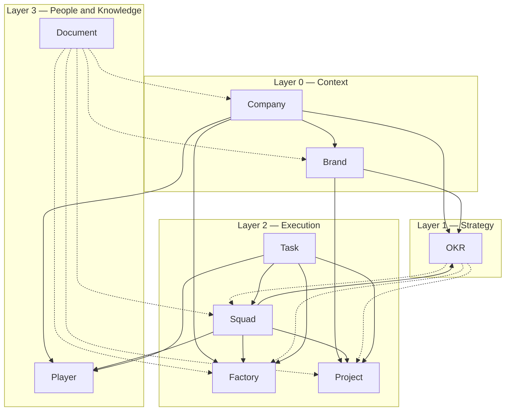

<!--
  Logo and hero image will be added in milestone M3.
  Current README is SEO-ready; visual assets follow.
-->

<h1 align="center">SquadFlow</h1>

  <strong>Factories run your business. Projects change it.</strong>

  An open framework for administering companies that balances <em>continuous execution</em> and <em>temporary initiatives</em>. 
  One ontology, nine entities, three layers — and a formal data model built for a future proprietary system.

  
  
  
  

---

## The three-layer model

## Why SquadFlow

Running a company is two different jobs.

- **Keeping the business alive** — sales, content, support, payroll. Continuous. The goal is rhythm.
- **Changing the business** — launching, migrating, expanding. Temporary. The goal is delivery.

Most frameworks pick one and pretend the other is a special case. Scrum optimizes change into sprints. Kanban optimizes flow and calls everything a ticket. SAFe tries to do both and collapses under its own weight.

SquadFlow is built around the distinction. **Factories** handle continuous operations; **Projects** drive change; **Squads** run both; **OKRs** align them to strategy. The distinction is formal, not rhetorical — it is encoded in lifecycles, in data schemas, and in the governance rules.

👉 Full rationale in the [**Manifesto**](MANIFESTO.md).

## The nine entities

| Layer | Entity | One-line | Reference |
|---|---|---|---|
| 🏢 **Context** | **Company** | A legal entity — the LLC/Ltda/Corp that signs contracts and pays taxes. | [`docs/ontology/company.md`](docs/ontology/company.md) |
| 🆔 Context | **Brand** | A commercial identity carried to market. | [`docs/ontology/brand.md`](docs/ontology/brand.md) |
| 🎯 **Strategy** | **OKR** | Objective + Key Results for a period, scored at close. | [`docs/ontology/okr.md`](docs/ontology/okr.md) |
| 🏭 **Execution** | **Factory** | Continuous production. Permanent. Owns a kanban. | [`docs/ontology/factory.md`](docs/ontology/factory.md) |
| 🚀 Execution | **Project** | Temporary initiative with start, scope, end — or absorbed into a Factory. | [`docs/ontology/project.md`](docs/ontology/project.md) |
| 🤝 Execution | **Squad** | Cross-functional team of two or more Players. | [`docs/ontology/squad.md`](docs/ontology/squad.md) |
| ✅ Execution | **Task** | Atomic unit of work assigned to one Player. | [`docs/ontology/task.md`](docs/ontology/task.md) |
| 🏀 **People** | **Player** | The individual who executes. Holds Roles. | [`docs/ontology/player.md`](docs/ontology/player.md) |
| 📚 Knowledge | **Document** | Recorded knowledge attached to other entities. | [`docs/ontology/document.md`](docs/ontology/document.md) |

See the full visual map in [`docs/concepts/overview.md`](docs/concepts/overview.md).

## Quickstart

No installation. SquadFlow runs on Notion, on paper, or on whatever tool you already use.

1. **Create one Company and one Brand.** Even a single-brand startup creates both records — they diverge the day you grow.
2. **Identify your Factories and your Projects.** A sales pipeline is a Factory. Building a new feature is a Project.
3. **Pick 1–3 OKRs for the quarter.** Objective + 2–4 measurable Key Results.
4. **Form your Squads.** Cross-functional, 2+ Players, one Squad Lead.
5. **Set your cadence.** Daily Debriefing, weekly Squad Sync, weekly Factory Review, quarterly OKR Review.

A downloadable Notion template ships with v1.0. Until then, follow [`docs/concepts/overview.md`](docs/concepts/overview.md).

## How SquadFlow compares

| Framework | Focus | What SquadFlow adds | What they have that SquadFlow does not |
|---|---|---|---|
| **Scrum** | Team-level iterative delivery | Continuous operations (Factories), formal ontology, OKRs as first-class | 30 years of adoption, certifications |
| **Kanban Method** | Flow | Lifecycles, Roles, cadences | Minimalism |
| **Shape Up** | Product teams in cycles | Continuous ops, multi-brand, OKRs | Shaping / betting mental models |
| **SAFe** | Enterprise agile | Leanness, open license, API-first | PI planning, enterprise sales motion |
| **OKRs alone** | Goal setting | An operational frame around the goals | Universality |

Detailed comparisons live under [`docs/comparisons/`](docs/comparisons/) (shipping in M3).

## Who uses it

**Grupo Solyd** — the framework was born from the day-to-day operation of **Guardsi** (B2B cybersecurity services and education), **Mindz** (SaaS for infoproduct businesses), **Solyd** (cybersecurity education), **Caveiratech** (media), and **Solyd Hunter** (talent program). The case study ships in [`examples/multi-brand-group.md`](examples/multi-brand-group.md) with M4.

If you are running SquadFlow in your own organization, open an issue or PR to add yourself here.

## The five principles

From the [Manifesto](MANIFESTO.md):

1. **Factories run your business. Projects change it.**
2. **Every entity has a single owner.** Never a committee.
3. **States are explicit.** Ambiguity about status is the leading cause of stalled work.
4. **Strategy and execution share one model.**
5. **Open by default.**

## Documentation map

| Area | What lives there |
|---|---|
| [Manifesto](MANIFESTO.md) | Principles and rationale. |
| [Overview](docs/concepts/overview.md) | Three-layer model, entity map. |
| [Glossary](docs/concepts/glossary.md) | Canonical definitions. |
| [Ontology](docs/ontology/) | One file per entity — purpose, attributes, relations, examples, antipatterns. |
| [Lifecycles](docs/lifecycles/) | State machines per entity, transitions, state-dependent behavior. |
| [Processes](docs/processes/) | Roles, cadences, ceremonies, governance. |
| [Data model](docs/data-model/) | JSON Schemas, ER diagram, code-generation guidance. |
| [Examples](examples/) | Worked examples (shipping in M4). |
| [Comparisons](docs/comparisons/) | SquadFlow vs. Scrum / Shape Up / SAFe / OKRs alone (shipping in M3). |
| [Notion template](templates/notion/) | Importable starter workspace (shipping in M4). |

## Contributing

See [CONTRIBUTING.md](CONTRIBUTING.md) and [CODE_OF_CONDUCT.md](CODE_OF_CONDUCT.md). Translations are welcome under `i18n/<lang>/`.

Security and sensitive disclosures follow the policy in [SECURITY.md](SECURITY.md).

## License

SquadFlow is licensed under [CC-BY-SA 4.0](LICENSE). You are free to:

- **Share** — copy and redistribute the material in any medium or format.
- **Adapt** — remix, transform, and build upon the material for any purpose, including commercially.

Under the conditions of **attribution** and **share-alike** (derivatives stay under the same license). Read the full terms in [`LICENSE`](LICENSE).

## Author

**Guilherme Junqueira Soares**
CEO — Solyd Research
guilherme[at]solyd[.]com[.]br

---

SquadFlow is a young framework. v1.0 is the first public release; the ontology may evolve with feedback. Star the repo to follow along.
