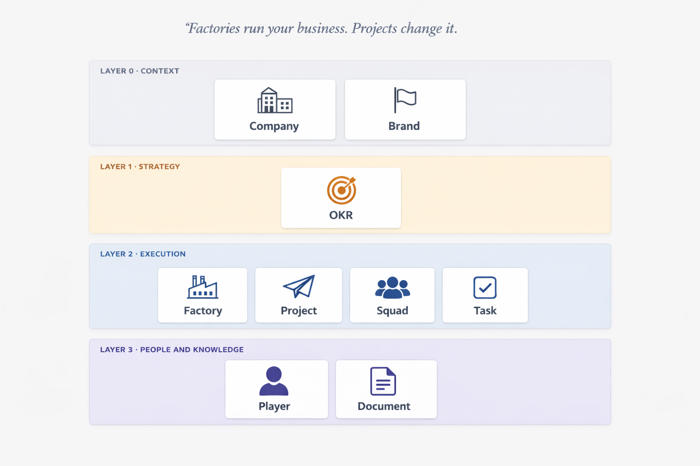

<p align="center">
  <picture>
    <source media="(prefers-color-scheme: dark)" srcset="docs/assets/logo-dark.png">
    
  </picture>
</p>

<h1 align="center">SquadFlow</h1>

<p align="center">
  <strong>Factories run your business. Projects change it.</strong>
</p>

<p align="center">
  An open framework for administering companies that balances <em>continuous execution</em> and <em>temporary initiatives</em>.<br>
  One ontology, nine entities, three layers — and a formal data model built for a future proprietary system.
</p>

<p align="center">
  <a href="LICENSE"></a>
  
  
  <a href="https://github.com/guilhermej/squadflow-framework/stargazers"></a>
</p>

<p align="center">
  
</p>

> [!IMPORTANT]
> **The whole point in one sentence:**
> Continuous work and change work are different disciplines, and most frameworks pretend they aren't.
> SquadFlow keeps them apart — and names the moment a successful change becomes a routine.

## Is SquadFlow for you?

| ✅ Yes, if you are… | ❌ No, if you are… |
|---|---|
| A founder, COO, or chief of staff at a **10–200 person company**. | A team of 5. Just talk to each other. |
| Running **more than one brand, product line, or business unit**. | A single Scrum team shipping one product — keep Scrum. |
| Tired of duct-taping Scrum + Kanban + OKRs + "process" together. | Already 500+ people deep in SAFe — switching costs are real. |
| Willing to pay the small tax of **naming things explicitly**. | Allergic to ontology. |
| Planning to eventually build software *on top of* your operating model. | Looking for a certification track. None here. |

## Contents

1. [Why SquadFlow](#why-squadflow)
2. [The five principles](#the-five-principles)
3. [The nine entities](#the-nine-entities)
4. [Lifecycles at a glance](#lifecycles-at-a-glance)
5. [Cadence stack](#cadence-stack)
6. [Roles](#roles)
7. [Governance](#governance)
8. [Quickstart](#quickstart)
9. [How SquadFlow compares](#how-squadflow-compares)
10. [Data model](#data-model)
11. [Who uses it](#who-uses-it)
12. [Ready to try it?](#ready-to-try-it)
13. [Full reference](#full-reference)
14. [Contributing & license](#contributing--license)

## Why SquadFlow

Running a company is two different jobs.

**One is keeping the business alive** — closing deals every week, shipping content, answering support, processing payroll. The work never stops. The goal is rhythm.

**The other is changing the business** — launching a product, migrating a system, entering a new market. The work has a beginning and an end. The goal is delivery.

Take a sales pipeline. `Prospect → Qualified → Proposal → Won`. It never empties. Next week there will be new prospects, whether you planned for them or not. This is a **Factory**. Forcing it into two-week sprints is a category error.

Now take *"migrate our billing system from a custom codebase to Stripe"*. It has a scope, a start, and a finish. When it's done, it's done — Stripe runs itself. This is a **Project**. It would be absurd to hand it to the sales team's kanban.

Most frameworks pick one side and pretend the other is a special case. Scrum optimizes change into sprints. Kanban optimizes flow and calls everything a ticket. SAFe tries to do both and collapses under its own weight. SquadFlow keeps them distinct from day one — in the lifecycles, in the data schemas, in the governance rules.

> [!TIP]
> **The trick most frameworks miss:** when a Project succeeds and produces something that *must* be operated forever (a partner portal, a new hiring pipeline, a content channel), SquadFlow has a dedicated state for that transition — `absorbed`. The Project closes; a new Factory is born. No work becomes invisible. No ownership evaporates.

If this framing clicks for you, read on. If it doesn't, no framework will fix the problem — the issue is somewhere else.

## The five principles

1. **Factories run your business. Projects change it.** A Factory is permanent; a Project has a start, a scope, and an end.
2. **Every entity has a single owner.** Never a committee. If no one is personally accountable, the thing drifts — that's a physics law, not an opinion.
3. **States are explicit.** "Done" is not a state. "In progress" is not a state. A state is one of a short, finite list, with documented entry and exit conditions. Ambiguity about status is the leading cause of stalled work, and stalled work is silent.
4. **Strategy and execution share one model.** OKRs are first-class citizens in the same graph as Factories, Projects, and Squads — not a separate tool maintained by a separate team.
5. **Open by default.** [CC-BY-SA 4.0](LICENSE). Adapt, translate, build on it. Credit the origin. Keep derivatives open.

Full rationale: [MANIFESTO.md](MANIFESTO.md).

## The nine entities

SquadFlow's ontology has **nine first-class entities in four layers**. No more, no less.

### 🌍 Context — where work happens

- 🏢 **[Company](docs/ontology/company.md)** — A legal entity (LLC/Ltda/Corp) that signs contracts and pays taxes. Example: *Guardsi Tecnologia LTDA*.
- 🆔 **[Brand](docs/ontology/brand.md)** — A commercial identity owned by a Company. Example: *Solyd*, *Caveiratech* — both carried by the same Company.

### 🎯 Strategy — why work happens

- 🎯 **[OKR](docs/ontology/okr.md)** — Objective and Key Results for a period, scored at close. Example: *"Become the preferred billing platform for LATAM SaaS"* with 2–4 measurable KRs.

### ⚙️ Execution — how work happens

- 🏭 **[Factory](docs/ontology/factory.md)** — Continuous production. Example: *B2B Sales Factory* with stages `Prospect → Qualified → Proposal Sent → In Negotiation → Won`.
- 🚀 **[Project](docs/ontology/project.md)** — Temporary initiative. Example: *Billing Migration to Stripe* — starts Feb, ends May, closes with `delivered`.
- ⚔️ **[Squad](docs/ontology/squad.md)** — Cross-functional team. Example: *Platform Squad* of 6 (3 engineers, 1 designer, 1 PM, 1 Lead) running one Factory + one Project.
- ✅ **[Task](docs/ontology/task.md)** — Atomic unit of work. Example: *"Write the Stripe connector module"*, assigned to Ana, blocked on prod access, due May 10.

### 🏀 People and Knowledge — who and what persists

- 🏀 **[Player](docs/ontology/player.md)** — The individual. Example: Ana joins as `candidate`, becomes `active` on day 1, promoted to Squad Lead six months later.
- 📄 **[Document](docs/ontology/document.md)** — Recorded knowledge. Example: *Sales Factory Operating Manual*, owned by the Factory Manager, flagged `outdated` if unreviewed for 6 months.

### Core relationships

- A **Company** owns many **Brands**, employs **Players**, runs **Factories**, and scopes **OKRs** and **Projects**.
- A **Brand** can scope its own **OKRs**, **Projects**, and **Factories**.
- A **Squad** is responsible for running **Factories** and executing **Projects**. It can also have squad-level **OKRs**.
- Every **Task** belongs to exactly one **Factory**, **Project**, or **Squad**, assigned to exactly one **Player**.
- **OKRs** are contributed to by **Factories**, **Projects**, and **Squads** (many-to-many).
- A successful **Project** producing continuous output is *absorbed* into a new **Factory** at close.
- **Documents** attach to any entity for knowledge persistence.

Full schema with cardinalities: [`docs/data-model/er-diagram.svg`](docs/data-model/er-diagram.svg).

## Lifecycles at a glance

Every entity has a finite state machine. Full diagrams in [`docs/lifecycles/`](docs/lifecycles/); summary below.

| Entity | States | Key transition |
|---|---|---|
| Company | `active → archived` | Archived only on legal dissolution. |
| Brand | `active → archived` | Archived when sunset in the market. |
| OKR | `draft → active → in_review → closed` | At close: `achieved` (score ≥ 0.7), `partially_met`, or `missed`. |
| Factory | `proposed → active ⇄ paused → retired` | Retirement requires Steward + Manager approval. |
| Project | `idea → scoping → backlog → active → delivery → closed` | Close reason: `delivered`, `canceled`, or **`absorbed`** into a new Factory. |
| Squad | `forming → active ⇄ on_hold → dissolving → dissolved` | Dissolution hands off all Factories/Projects explicitly. |
| Task | `todo → in_progress ⇄ blocked → done` | Done reason: `completed` or `canceled`. |
| Player | `candidate → active ⇄ on_leave → offboarded` | Offboarding reassigns Tasks and drops Squad membership; record preserved. |
| Document | `draft → in_review → published ⇄ outdated → archived` | `outdated` is a first-class flag — stale docs are marked, not hidden. |

> [!NOTE]
> The `absorbed` transition is the most important motion in SquadFlow. When a successful Project has to be operated continuously, it becomes a new Factory — with a new Manager, a new kanban, and a decision-log entry recording why.

## Cadence stack

| Frequency | Ceremony | Scope | Duration | Convened by |
|---|---|---|---|---|
| Daily | Debriefing | all Players | ≤ 15 min | Squad Lead |
| Weekly | Squad Sync | per Squad | ~30 min | Squad Lead |
| Weekly | Factory Review | per Factory | ~30 min | Factory Manager |
| Monthly | Portfolio Review | Stewards + Leads | ~60 min | Org Steward |
| Quarterly | OKR Setting / Review | org-wide | ~90 min per session | OKR Sponsors |
| Quarterly | Strategic Cadence | Stewards | ~120 min | Org Steward |
| Yearly | Annual Planning + OKRs | org-wide | full day | Org Steward |

Plus ad-hoc ceremonies triggered by lifecycle transitions (Project Kickoff, Project Closing, Squad Formation, Squad Dissolution, Factory Retirement).

> [!TIP]
> Don't run all of these on day one. A 20-person company survives fine on daily Debriefing + weekly Squad Sync + quarterly OKR Review. Add more when you feel the gap — not because the framework says so.

Detail: [`docs/processes/cadences.md`](docs/processes/cadences.md) · [`docs/processes/ceremonies.md`](docs/processes/ceremonies.md).

## Roles

Roles are named responsibilities held by Players. One Player can hold several Roles. Roles are not job titles, not compensation tiers.

| Role | Scope | Responsibility |
|---|---|---|
| **Player** | individual | Executes Tasks; participates in Squad ceremonies. |
| **Squad Lead** | 1 Squad | Coordinates the Squad; ensures cadence runs. |
| **Factory Manager** | 1 Factory | Owns the kanban; runs weekly Review; maintains operating manual. |
| **Project Owner** | 1 Project | Accountable for delivery; decides close reason. |
| **OKR Sponsor** | N OKRs | Shapes, defends, and scores the OKR. |
| **Org Steward** | 1 Company or Brand | Approves state transitions; does *not* micromanage. |

Detail: [`docs/processes/roles.md`](docs/processes/roles.md).

## Governance

**Four principles:**

1. Every entity has a single owner — never a committee.
2. Approvals are logged — sensitive transitions create a decision-log entry.
3. Stewards do not micromanage — they approve state transitions, not Tasks.
4. Roles are not titles — named responsibilities, not compensation tiers.

**Who approves what (summary):**

| Action | Approver(s) |
|---|---|
| Create / archive Company, Brand | Org Steward |
| Create Factory | Org Steward |
| Retire Factory | Org Steward + Factory Manager |
| Create Project | Project Owner (+ OKR Sponsor if OKR-linked) |
| Cancel Project | Project Owner + Org Steward |
| Absorb Project → Factory | Project Owner + Org Steward |
| Form / dissolve Squad | Squad Lead + Org Steward |
| Define / close OKR | OKR Sponsor |
| Offboard Player | HR + Org Steward |
| Publish Document | Owner (after review) |
| Assign / cancel Task | Squad Lead, Factory Manager, or Project Owner |

Full RACI matrix and decision-log pattern: [`docs/processes/governance.md`](docs/processes/governance.md).

## Quickstart

<p>
    
</p>

1. **Create one Company and one Brand.** Even a single-brand startup creates both — they diverge the day you grow.
2. **Identify your Factories and your Projects.** A sales pipeline is a Factory. Building a new feature is a Project. If it never ends, it's a Factory. If it has a due date, it's a Project.
3. **Pick 1–3 OKRs for the quarter.** Objective + 2–4 measurable Key Results. Assign a Sponsor to each. Fewer than 1 means you're coasting; more than 3 means nothing is a priority.
4. **Form your Squads.** Cross-functional, 2+ Players, one Squad Lead. Assign Factories and Projects.
5. **Set your cadence.** Daily Debriefing, weekly Squad Sync, weekly Factory Review, quarterly OKR Setting/Review. Everything else is optional at first.

> [!TIP]
> Hit a question not obviously answered? Three places to look:
>
> - **What is this thing?** → [`docs/ontology/`](docs/ontology/)
> - **What state can it be in?** → [`docs/lifecycles/`](docs/lifecycles/)
> - **Who approves it?** → [`docs/processes/governance.md`](docs/processes/governance.md)

Step-by-step walkthrough: [`docs/getting-started.md`](docs/getting-started.md). Downloadable Notion template ships with v1.0 in [`templates/notion/`](templates/notion/).

## How SquadFlow compares

| Dimension | **SquadFlow** | Scrum | Shape Up | SAFe | OKRs alone |
|---|---|---|---|---|---|
| Scope | whole org | single team | product team | enterprise | strategy only |
| Continuous ops | **Factory (first-class)** | not native | not modeled | peripheral | invisible |
| Temporary initiatives | **Project (first-class)** | sprints | bets | epics | — |
| Strategy link | **OKR native, relational** | external | qualitative | epics↔OKRs | it *is* OKRs |
| Multi-brand | **yes** | no | no | enterprise-scale | no |
| Data model | **JSON Schemas** | informal | informal | informal | informal |
| License | **CC-BY-SA 4.0** | Attribution-ShareAlike | CC-BY-NC-ND | proprietary | public domain |
| Target size | 10–200 | 5–15 team | 5–30 | 500+ | any |

Detailed per-framework comparisons: [`docs/comparisons/`](docs/comparisons/).

**When to pick something else, honestly:**

- **Team of 5** → no framework. Frameworks are for when communication starts breaking. You're not there yet.
- **Single Scrum team, one product** → Scrum. Seriously, stop adding things.
- **Enterprise, 500+ engineers, already committed to SAFe** → stay. Switching isn't free. SquadFlow doesn't scale to your shape anyway.
- **Looking for certifications and a coach network** → SAFe or Scrum.org. SquadFlow offers neither and doesn't plan to.

## Data model

SquadFlow ships with a **formal data model**: nine JSON Schemas (draft 2020-12), an ER diagram, and naming conventions. Validated in CI; generate idiomatic clients without manual edits.

```bash
# TypeScript
npx json-schema-to-typescript docs/data-model/schemas/project.schema.json

# Python (Pydantic)
datamodel-codegen --input docs/data-model/schemas/project.schema.json \
  --output project.py --input-file-type jsonschema
```

Source: [`docs/data-model/`](docs/data-model/) — conventions, ER diagram, 9 schemas, test fixtures.

> [!NOTE]
> Most management frameworks ship as prose. SquadFlow ships as prose *and* a machine-readable contract. That's deliberate — we expect someone to build proprietary software on top of this, and we'd rather they start from valid schemas than from paraphrased opinions.

## Who uses it

<p align="center">
<strong>1 Group</strong> · <strong>2 Companies</strong> · <strong>5 Brands</strong> · <strong>used daily since 2024</strong>
</p>

**[Grupo Solyd](https://solyd.com.br)** — the framework was born here, stress-tested here, and is the reason every decision in v1.0 is opinionated the way it is.

- **Guardsi** — B2B cybersecurity services and education.
- **Mindz** — SaaS platforms for infoproduct businesses.
- **Solyd** — cybersecurity education (LATAM's largest).
- **Caveiratech** — content and media.
- **Solyd Hunter** — talent program.

A detailed case study ships in [`examples/multi-brand-group.md`](examples/multi-brand-group.md) with v1.0.

> [!NOTE]
> Running SquadFlow in your own organization? Open an Issue or PR to add yourself here. Credibility compounds.

## Ready to try it?

<table>
<tr>
<td align="center" width="33%">
  <a href="https://github.com/guilhermej/squadflow-framework">⭐</a><br>
  <strong><a href="https://github.com/guilhermej/squadflow-framework">Star the repo</a></strong><br>
  <sub>Follow along as v1.0 ships</sub>
</td>
<td align="center" width="33%">
  <a href="templates/notion/">📥</a><br>
  <strong><a href="templates/notion/">Download Notion template</a></strong><br>
  <sub>Import, populate, you're running it (v1.0)</sub>
</td>
<td align="center" width="33%">
  <a href="MANIFESTO.md">📖</a><br>
  <strong><a href="MANIFESTO.md">Read the Manifesto</a></strong><br>
  <sub>The whole thing in 400 words</sub>
</td>
</tr>
</table>

## Full reference

For deeper reading — especially if you are implementing the framework as software or adopting it formally:

| Area | What's there |
|---|---|
| [Manifesto](MANIFESTO.md) | The five principles, longer form. |
| [Glossary](docs/concepts/glossary.md) | Canonical definitions of every term. |
| [Ontology](docs/ontology/) | One file per entity — attributes, relations, examples, antipatterns. |
| [Lifecycles](docs/lifecycles/) | State machines per entity — diagrams, transitions, behavior. |
| [Processes](docs/processes/) | Roles, cadences, ceremonies, governance — in depth. |
| [Data model](docs/data-model/) | JSON Schemas, ER diagram, code-generation guidance. |
| [Comparisons](docs/comparisons/) | SquadFlow vs. Scrum / Shape Up / SAFe / OKRs (detailed). |
| [Getting started](docs/getting-started.md) | Step-by-step 15-minute walkthrough. |
| [Notion template](templates/notion/) | Importable starter workspace (ships with v1.0). |
| [Examples](examples/) | Worked cases — fictional SaaS, Grupo Solyd. |

## Contributing & license

Contributions, translations, and adaptations are welcome.

| Channel | For |
|---|---|
| [**Issues**](https://github.com/guilhermej/squadflow-framework/issues) | Bugs, typos, unclear wording, feature requests. |
| [**Discussions**](https://github.com/guilhermej/squadflow-framework/discussions) | Open questions, design debates, showcases. |
| [**Pull requests**](https://github.com/guilhermej/squadflow-framework/pulls) | Fixes, refinements, translations. See [CONTRIBUTING.md](CONTRIBUTING.md). |
| [**Security advisories**](https://github.com/guilhermej/squadflow-framework/security/advisories) | Sensitive disclosures — see [SECURITY.md](SECURITY.md). |

Before contributing, read [CONTRIBUTING.md](CONTRIBUTING.md) and [CODE_OF_CONDUCT.md](CODE_OF_CONDUCT.md).

**License:** [CC-BY-SA 4.0](LICENSE). You may share, adapt, and build commercial products on top — as long as you credit the origin and keep your derivatives under the same license. Attributions should point to <https://github.com/guilhermej/squadflow-framework>.

## Acknowledgments

SquadFlow stands on the shoulders of frameworks that came before:

- **Andy Grove** and **John Doerr** for the OKR discipline.
- **Basecamp / Ryan Singer** for Shape Up and the shaping/betting discipline borrowed in the `scoping` state of Projects.
- **Spotify** for the term *Squad* (used here with a narrower meaning — and yes, we know Spotify itself doesn't use the "Spotify Model" anymore).
- **Scrum.org** for the Scrum Guide, whose editorial discipline inspired this documentation's tone.

The framework was born inside [**Grupo Solyd**](https://solyd.com.br) and is tested daily against its reality. If it breaks there, it gets fixed here.

---

<table align="center">
<tr>
<td>
  <strong>Guilherme Junqueira Soares</strong><br>
  CEO — <a href="https://solyd.com.br">Solyd Research</a><br>
  guilherme[at]solyd[.]com[.]br · <a href="https://github.com/guilhermej">@guilhermej</a>
</td>
<td align="center" width="260">
  <a href="https://github.com/guilhermej/squadflow-framework/stargazers"></a>
  <a href="https://github.com/guilhermej/squadflow-framework/watchers"></a>
  <a href="https://github.com/guilhermej/squadflow-framework/forks"></a>
</td>
</tr>
</table>

<p align="center">
  <sub>
    <strong>SquadFlow is a young framework.</strong> v1.0 is the first public release; the ontology may evolve with feedback.<br>
    Built with care in Brazil · <a href="CHANGELOG.md">Changelog</a> · <a href="https://github.com/guilhermej/squadflow-framework/releases">Releases</a> · © 2026 Guilherme Junqueira Soares · <a href="LICENSE">CC-BY-SA 4.0</a>
  </sub>
</p>
