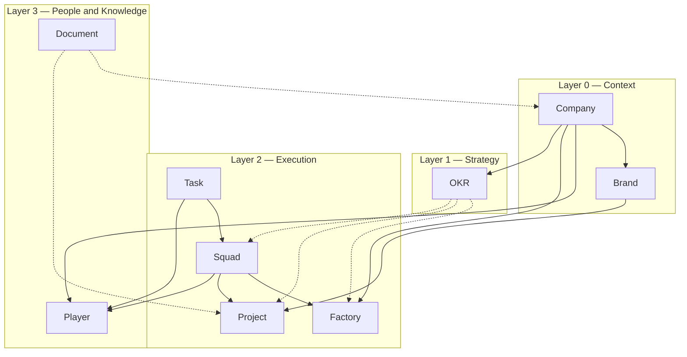

# Overview

SquadFlow is organized as a single graph of **nine first-class entities** arranged in **four layers**. Start here, then drill into any entity file for detail.

## The map

Solid arrows mean ownership or composition. Dashed arrows mean contribution or attachment — softer links that don't imply containment.

## Layer 0 — Context

The two entities at this layer describe **where the work happens**. A **Company** is a legal entity (CNPJ, LLC, Ltd). A **Brand** is a commercial identity owned by a Company. A single company can carry several brands; a brand usually belongs to one company. Context entities rarely change state — they are the containers into which everything else fits.

You need at least one Company to run SquadFlow. If you have only one brand and it has the same name as the company, you can collapse them mentally into a single entry and still be using SquadFlow correctly.

## Layer 1 — Strategy

**OKR** is the only entity at the strategy layer. Objectives and Key Results, borrowed from Andy Grove, are the bridge between *what we want* (a direction) and *what we are doing about it* (the work in Layer 2). OKRs are set quarterly by default, scored when the period ends, and linked back to the factories, projects and squads that contributed.

SquadFlow keeps OKRs first-class — not a Notion page off to the side — so that any execution item can truthfully answer *"which objective does this serve?"*.

## Layer 2 — Execution

This is where most of the work lives. Four entities here, each with its own shape:

- **Factory** — continuous production. Sales, content, support, recruiting, billing. The kanban never empties.
- **Project** — temporary initiative. Launch a product, migrate a system, build a new process. Start, scope, end.
- **Squad** — cross-functional team of Players. Squads are responsible for factories and projects. A squad can run more than one.
- **Task** — atomic unit of work. Lives on a factory's kanban, on a project's board, or assigned directly inside a squad.

The most important claim of SquadFlow is the **factory/project split**. Continuous and temporary work are different disciplines, even though the same people often do both. When a successful project produces something that must then be operated forever, it is *absorbed* into a new factory. This transition is named and governed, not improvised.

## Layer 3 — People and Knowledge

Two entities close the model:

- **Player** — the individual. Players belong to one or more squads. They are assigned to tasks. They have roles (see [`../processes/roles.md`](../processes/roles.md)) that describe what they are accountable for.
- **Document** — recorded knowledge. Manuals, policies, meeting notes, design docs, SOPs. Documents can attach to any other entity — a factory doc describes how to run the factory; a project doc records its decisions; a player doc is the onboarding guide.

Both exist so the framework doesn't lose track of the two things a company actually runs on: its people and its institutional memory.

## The nine entities at a glance

| Layer | Entity | One-line summary | Details |
|---|---|---|---|
| Context | Company | Legal entity (CNPJ/LLC/Ltd). | [`../ontology/company.md`](../ontology/company.md) |
| Context | Brand | Commercial identity owned by a Company. | [`../ontology/brand.md`](../ontology/brand.md) |
| Strategy | OKR | Objective + Key Results for a period. | [`../ontology/okr.md`](../ontology/okr.md) |
| Execution | Factory | Continuous production; permanent. | [`../ontology/factory.md`](../ontology/factory.md) |
| Execution | Project | Temporary initiative with start/end. | [`../ontology/project.md`](../ontology/project.md) |
| Execution | Squad | Cross-functional team of Players. | [`../ontology/squad.md`](../ontology/squad.md) |
| Execution | Task | Atomic unit of work for one Player. | [`../ontology/task.md`](../ontology/task.md) |
| People & Knowledge | Player | The individual. | [`../ontology/player.md`](../ontology/player.md) |
| People & Knowledge | Document | Recorded knowledge attached to other entities. | [`../ontology/document.md`](../ontology/document.md) |

## What comes next

- To understand **what each entity is** in depth: start at [`../ontology/`](../ontology/).
- To understand **how each entity evolves over time**: [`../lifecycles/`](../lifecycles/).
- To understand **who approves what**: [`../processes/governance.md`](../processes/governance.md).
- To understand **how the framework is formally defined for software**: [`../data-model/`](../data-model/).

If you are short on time, read [`./why-squadflow.md`](./why-squadflow.md) next. It is the short argument for why this framework exists at all.
