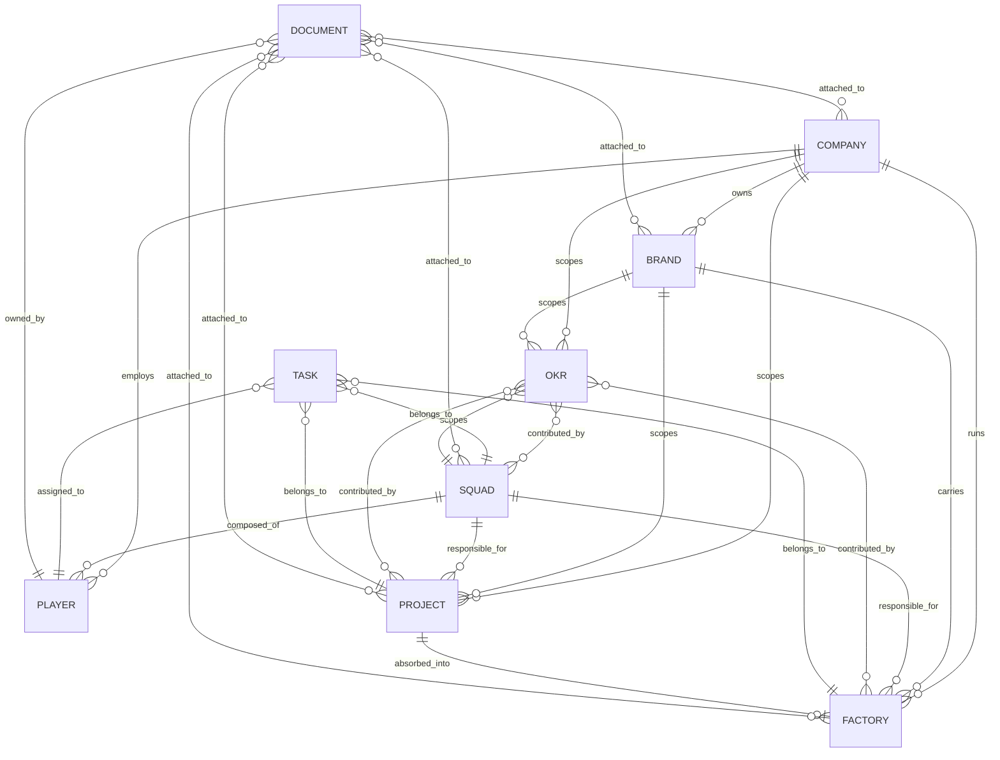

# Data Model

This folder is the **formal foundation for the future SquadFlow system**. Every entity in the ontology has a JSON Schema here. The schemas are validated in CI and can generate idiomatic clients (TypeScript, Python, Go) without modification.

## Contents

- [`conventions.md`](./conventions.md) — naming, IDs, timestamps, enums, versioning rules. Read this first.
- [`er-diagram.mermaid`](./er-diagram.mermaid) — editable Mermaid source of the entity-relation diagram.
- [`er-diagram.svg`](./er-diagram.svg) — rendered diagram (regenerated with `mmdc`).
- [`schemas/`](./schemas/) — one JSON Schema per entity, plus valid and invalid test fixtures under `_test_fixtures/`.

## Entity relations

The full entity-relation diagram:



The SVG is rendered from `er-diagram.mermaid` with `mmdc -t neutral -b transparent`. Edit the Mermaid file and regenerate.

## Schemas

| Entity | Schema | Valid fixture | Invalid fixture |
|---|---|---|---|
| Company | [`company.schema.json`](./schemas/company.schema.json) | [valid](./schemas/_test_fixtures/company.valid.json) | [invalid](./schemas/_test_fixtures/company.invalid.json) |
| Brand | [`brand.schema.json`](./schemas/brand.schema.json) | [valid](./schemas/_test_fixtures/brand.valid.json) | [invalid](./schemas/_test_fixtures/brand.invalid.json) |
| OKR | [`okr.schema.json`](./schemas/okr.schema.json) | [valid](./schemas/_test_fixtures/okr.valid.json) | [invalid](./schemas/_test_fixtures/okr.invalid.json) |
| Factory | [`factory.schema.json`](./schemas/factory.schema.json) | [valid](./schemas/_test_fixtures/factory.valid.json) | [invalid](./schemas/_test_fixtures/factory.invalid.json) |
| Project | [`project.schema.json`](./schemas/project.schema.json) | [valid](./schemas/_test_fixtures/project.valid.json) | [invalid](./schemas/_test_fixtures/project.invalid.json) |
| Squad | [`squad.schema.json`](./schemas/squad.schema.json) | [valid](./schemas/_test_fixtures/squad.valid.json) | [invalid](./schemas/_test_fixtures/squad.invalid.json) |
| Task | [`task.schema.json`](./schemas/task.schema.json) | [valid](./schemas/_test_fixtures/task.valid.json) | [invalid](./schemas/_test_fixtures/task.invalid.json) |
| Player | [`player.schema.json`](./schemas/player.schema.json) | [valid](./schemas/_test_fixtures/player.valid.json) | [invalid](./schemas/_test_fixtures/player.invalid.json) |
| Document | [`document.schema.json`](./schemas/document.schema.json) | [valid](./schemas/_test_fixtures/document.valid.json) | [invalid](./schemas/_test_fixtures/document.invalid.json) |

## Validating locally

```bash
python -m venv .venv
source .venv/bin/activate
pip install 'jsonschema>=4.20'

python <<'PY'
import json, pathlib
from jsonschema import Draft202012Validator

for schema_path in sorted(pathlib.Path('docs/data-model/schemas').glob('*.schema.json')):
    entity = schema_path.stem.replace('.schema', '')
    schema = json.load(open(schema_path))
    Draft202012Validator.check_schema(schema)
    v = Draft202012Validator(schema)
    v.validate(json.load(open(f'docs/data-model/schemas/_test_fixtures/{entity}.valid.json')))
    try:
        v.validate(json.load(open(f'docs/data-model/schemas/_test_fixtures/{entity}.invalid.json')))
        print(f'FAIL: {entity} invalid was accepted')
    except Exception:
        print(f'OK: {entity}')
PY
```

CI runs the same check on every pull request — see [`.github/workflows/lint.yml`](../../.github/workflows/lint.yml).

## Generating clients

The schemas follow conservative conventions (see [`conventions.md`](./conventions.md)) so they can generate idiomatic client code in several languages.

### TypeScript

```bash
npx json-schema-to-typescript \
  docs/data-model/schemas/project.schema.json > project.d.ts
```

### Python (Pydantic)

```bash
pip install datamodel-code-generator
datamodel-codegen \
  --input docs/data-model/schemas/project.schema.json \
  --output project.py \
  --target-python-version 3.11 \
  --input-file-type jsonschema
```

### Go

Use [`quicktype`](https://quicktype.io) or similar:

```bash
quicktype --src-lang schema --lang go \
  --src docs/data-model/schemas/project.schema.json \
  --out project.go
```

If a generated client looks wrong, the usual culprit is a schema that violates the conventions. Fix the schema — the generated code should not need manual edits.

## Versioning and compatibility

- Schemas are v1.0 frozen on release. Breaking changes are forbidden within a major version.
- Additive changes (new optional fields, new optional enum values) are allowed in minor versions.
- Breaking changes require v2.0 and a migration guide.

See [`conventions.md`](./conventions.md) section 10 for the full rule.
