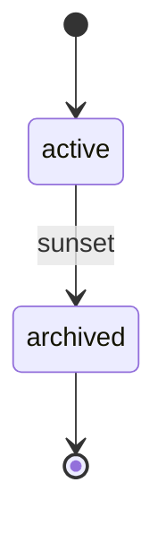

# Brand Lifecycle

> A Brand has a trivial lifecycle: `active` until `archived`. Archive means the market no longer sees the brand.

## State diagram

## States

| State | Description | Entry conditions | Exit conditions |
|---|---|---|---|
| `active` | Brand is live in the market. | Created under an `active` Company. | Brand is sunset (rebrand, merge, or discontinuation). |
| `archived` | No longer a market-facing identity. | `sunset` transition fired. | Terminal. |

## Transitions

| From | To | Trigger | Actor | Validation | Side effects |
|---|---|---|---|---|---|
| — | `active` | `create` | Org Steward | At least one `company_id` set; owning Company must be `active`. | Record created. `created_at` set. |
| `active` | `archived` | `sunset` | Org Steward | All Projects and Factories scoped exclusively to this Brand must be closed or re-scoped. | `archived_on` set. Historical links preserved. |

## State-dependent behavior

- When `active`: the Brand appears in reports, can scope Projects, carry Factories, and sponsor Brand-level OKRs.
- When `archived`: the Brand is hidden from operational dashboards. Historical attribution remains — OKRs scored last quarter still point to the Brand.

## Examples

### Example 1 — A brand launched and kept

*Helios* (Brand) is launched under *Helios Corp.* (Company) on the product GA date. It stays `active` for as long as the company markets the product. No further transitions.

### Example 2 — Sunsetting a secondary brand

A multi-brand group retires a legacy content Brand. Before archival, the Org Steward moves any remaining Projects to another Brand or closes them. Ongoing Factories are either re-scoped to a sibling Brand or retired. Only after the Brand has no active children does the Steward fire `sunset`. The Brand record stays — past content and historical OKRs still reference it for attribution — but no new work is scoped to it.
