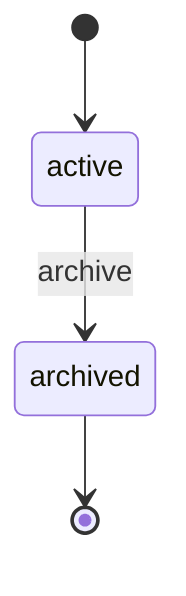

# Company Lifecycle

> A Company has a trivial lifecycle: it is `active` until it is `archived`. Archive reflects legal dissolution, merger, or sale.

## State diagram

## States

| State | Description | Entry conditions | Exit conditions |
|---|---|---|---|
| `active` | Operating legal entity. Default state. | Created in the system. | Legal dissolution, merger, or sale. |
| `archived` | No longer operating as an independent legal entity. | `archive` transition fired. | Terminal. |

## Transitions

| From | To | Trigger | Actor | Validation | Side effects |
|---|---|---|---|---|---|
| — | `active` | `create` | Org Steward | Valid `tax_id`, `legal_name`, `jurisdiction`. | Record created. `created_at` set. |
| `active` | `archived` | `archive` | Org Steward | All Brands, Factories, and active Projects owned by this Company must already be archived or closed. | `archived_on` set. Historical links preserved. |

## State-dependent behavior

- When `active`: the Company appears in all dashboards, can own new Brands, employ new Players, and sponsor OKRs.
- When `archived`: the Company is hidden from operational dashboards but remains queryable in historical reports. No new entities can be attached.

## Examples

### Example 1 — A company operating normally

*Helios Corp.* is created with `state = active` when the founder registers the LLC. It stays `active` indefinitely while the business operates. No further transitions unless the company is sold or dissolved.

### Example 2 — Archiving after acquisition

A multi-brand group acquires *Helios Corp.* and merges the legal entity into its own. Before archiving, all *Helios* Brands, Factories, and active Projects are re-parented (usually to a successor Company in the new group) or archived. Only after the Company is empty does the Org Steward fire `archive`. The record stays — historical Tasks, OKRs, and Documents still point to it — but new work lands under the successor.
