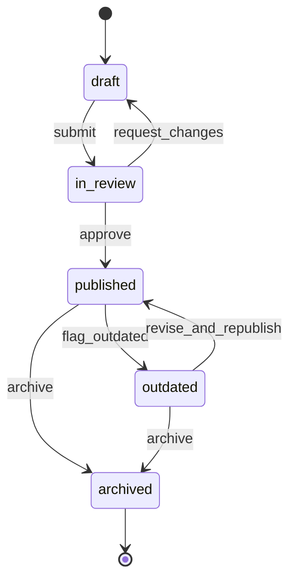

# Document Lifecycle

> A Document is authored as a `draft`, goes through `in_review`, becomes `published`, may be flagged `outdated`, and is eventually `archived` when no longer useful.

## State diagram

## States

| State | Description | Entry conditions | Exit conditions |
|---|---|---|---|
| `draft` | Being authored or edited. Not yet canonical. | Created by the owner. | Submit for review. |
| `in_review` | Awaiting approval. | Owner submitted. | Approved or sent back. |
| `published` | Canonical. Readers can rely on it. | Approved. | Flagged `outdated` or archived. |
| `outdated` | Still reachable, but readers are warned. | Content no longer accurate. | Revised back to `published` or archived. |
| `archived` | No longer relevant. Preserved for history only. | Explicit decision to archive. | Terminal. |

## Transitions

| From | To | Trigger | Actor | Validation | Side effects |
|---|---|---|---|---|---|
| — | `draft` | `create` | Player (any) | `owner_id` set, `title` set. | Record created. |
| `draft` | `in_review` | `submit` | Owner | Body present (`body_url` or `body_markdown`). | Reviewers notified. |
| `in_review` | `draft` | `request_changes` | Reviewer | Reviewer feedback attached. | Owner notified. |
| `in_review` | `published` | `approve` | Reviewer | Approval recorded. | `published_at` set. Readers can link to the doc. |
| `published` | `outdated` | `flag_outdated` | Any Player | Reason recorded. | `outdated_at` set. Banner displayed to readers. |
| `outdated` | `published` | `revise_and_republish` | Owner | New version content merged. | `published_at` updated. `outdated_at` cleared. `version` bumped. |
| `published` / `outdated` | `archived` | `archive` | Owner + Steward | No active entity references the doc exclusively. | `archived_at` set. Hidden from normal views. |

## State-dependent behavior

- When `draft`: visible only to the owner and invited collaborators. Not linked from operational dashboards.
- When `in_review`: reviewers see it in their queue. Not yet linked as canonical.
- When `published`: appears as canonical wherever the doc is attached. Readers trust it.
- When `outdated`: a visible "⚠ outdated" banner or marker is rendered wherever the doc appears. Readers know to treat with care.
- When `archived`: hidden from standard views. Still queryable by ID for historical research.

## Examples

### Example 1 — A factory manual that stays current

The *Sales Factory* Manager writes the *Sales Factory Operating Manual* as a draft, submits it for review. The VP of Sales reviews, requests changes once (back to `draft`), re-reviews, approves (`published`). Six months later, the sales process changes; the Manager revises, bumps `version`, republishes. The Document stays `published` for years.

### Example 2 — A document that goes outdated and is eventually archived

The *Billing Migration* Project Owner maintains a *Legacy Billing Runbook* Document that is `published` during the migration. After the migration closes, the Runbook is still referenced by a handful of operators. Twelve months later, the legacy system is gone. The owner flags the Runbook `outdated` (nobody should use it), and two months after that archives it — the record stays for historical context, but the content is no longer relevant.
