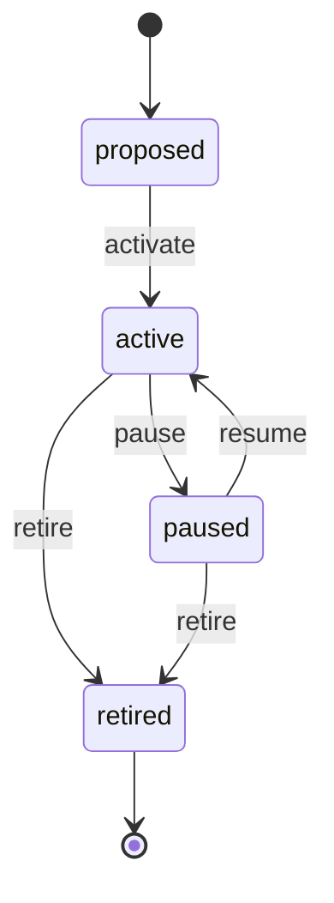

# Factory Lifecycle

> A Factory is `proposed`, `active`ed when it begins producing, may be `paused` reversibly, and eventually `retired` when the business no longer needs the output.

## State diagram

## States

| State | Description | Entry conditions | Exit conditions |
|---|---|---|---|
| `proposed` | Approved in principle. Kanban stages being designed; Squad and Manager being named. | Proposed by Squad Lead or Org Steward. | Activation or abandonment. |
| `active` | Producing. Kanban runs its normal cadence. Weekly Factory Review happens. | `activate` fired. | Pause or retirement. |
| `paused` | Temporarily not producing. No new cards accepted. Existing work-in-progress handled case by case. | `pause` fired with a reason. | Resume or retirement. |
| `retired` | No longer needed. | `retire` fired. | Terminal. |

## Transitions

| From | To | Trigger | Actor | Validation | Side effects |
|---|---|---|---|---|---|
| — | `proposed` | `create` | Squad Lead or Org Steward | `name`, `company_id`, `squad_id`, `manager_id`, `kanban_stages` (≥ 2). | Record created. `proposed_on` set. |
| `proposed` | `active` | `activate` | Squad Lead + Org Steward | Kanban stages final. Manager confirmed. First Task on the board. | `activated_on` set. Factory appears in dashboards. Weekly Factory Review scheduled. |
| `active` | `paused` | `pause` | Squad Lead + Org Steward | Reason recorded (demand drop, capacity issue, seasonal). | `paused_on` set. Dashboards show the Factory with a "⏸" marker. No new cards accepted. |
| `paused` | `active` | `resume` | Squad Lead + Org Steward | Capacity restored. Manager still assigned. | `paused_on` cleared. Factory returns to normal operation. |
| `active` / `paused` | `retired` | `retire` | Org Steward + Factory Manager | All open Tasks closed (completed or canceled). Business decision to sunset logged with rationale. | `retired_on` set. Factory hidden from operational dashboards. Historical metrics preserved. Decision-log entry created. |

## State-dependent behavior

- When `proposed`: appears in a proposals queue. Cannot accept Tasks yet.
- When `active`: default. Appears in all relevant dashboards. Weekly Factory Review runs. Tasks can be created on the kanban.
- When `paused`: appears with "⏸" marker. New-Task creation blocked. Factory Review skipped (or held as a short status update).
- When `retired`: hidden. Past metrics, Tasks, and Documents remain queryable for historical analysis.

## Examples

### Example 1 — A sales factory, activated and running

*Helios Corp.* proposes a *B2B Sales* Factory. The Squad Lead designs the kanban (*Prospect → Qualified → Proposal Sent → In Negotiation → Won*), names the Head of Sales as Factory Manager, staffs the *Sales* Squad. `state = proposed` for two weeks while the setup lands. On activation day, `activate` fires; the first Prospect card is created; the first weekly Factory Review is held that Thursday. The Factory runs indefinitely — no terminal date planned.

### Example 2 — A content factory paused for rework

A content Factory is `active` for a year. Engagement metrics drop sharply. The Squad Lead pauses to investigate. `pause` fires with the reason "engagement drop — process needs rework". No new cards enter. A Project (`Content Process v2`) is started in parallel to fix the root cause. Three months later, the Project delivers an improved process; the Factory `resume`s with the new kanban stages and runs normally again.

### Example 3 — A factory retired after its mandate disappears

A multi-brand group runs a Factory dedicated to a specific brand's monthly marketing campaigns. After two years the Brand is sunset. The Factory's remaining Tasks are closed; the Manager and Org Steward fire `retire` with the rationale "Brand X sunset 2027-06". `retired_on` set. The Factory disappears from active views; historical campaign metrics stay queryable.
