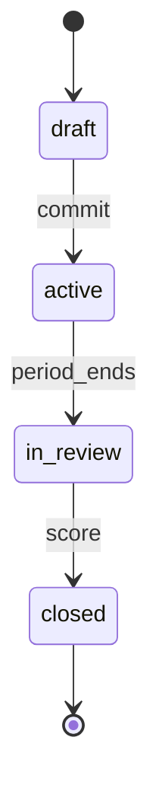

# OKR Lifecycle

> An OKR is shaped in `draft`, pursued during `active`, scored during `in_review`, and filed as `closed` with a score and an outcome tier.

## State diagram

## States

| State | Description | Entry conditions | Exit conditions |
|---|---|---|---|
| `draft` | Being shaped — Objective and Key Results are still being negotiated. | Created by the sponsor. | Committed for the period. |
| `active` | The period is underway. The organization is pursuing the OKR. | `commit` fired. | Period ends. |
| `in_review` | Period has ended. Scoring in progress. | `period_ends` fired. | Sponsor records final scores. |
| `closed` | Scored and filed. | `score` fired. | Terminal. |

## Transitions

| From | To | Trigger | Actor | Validation | Side effects |
|---|---|---|---|---|---|
| — | `draft` | `create` | OKR Sponsor | `objective`, at least one `key_result`, `period`, `company_id`. | Record created. |
| `draft` | `active` | `commit` | OKR Sponsor + Org Steward (for company-level) | Baseline, target, and unit set for every Key Result. Commitment type declared (`committed` or `aspirational`). | `state = active`. OKR appears in dashboards. |
| `active` | `in_review` | `period_ends` | Automatic (calendar trigger) or Sponsor | Period end date reached. | Dashboards show the OKR in review. Sponsor is notified to score. |
| `in_review` | `closed` | `score` | OKR Sponsor | Per-KR `score` (0.0–1.0) set; overall `score` calculated. | `close_outcome` assigned based on thresholds. Decision-log entry created. |

## Scoring rules

At close, each Key Result scores 0.0–1.0 based on progress from baseline to target (linear by default; non-linear scales are allowed but must be documented in the OKR's notes). The overall `score` is the unweighted mean of KR scores, unless the Sponsor explicitly weights them.

`close_outcome` follows strict thresholds:

| Score range | Outcome |
|---|---|
| `score >= 0.7` | `achieved` |
| `0.3 <= score < 0.7` | `partially_met` |
| `score < 0.3` | `missed` |

For `committed` OKRs, a `missed` outcome is a real miss — logged, retrospected, accountable. For `aspirational` OKRs, a missed score is expected; the threshold is still applied for reporting but carries no accountability implication.

## State-dependent behavior

- When `draft`: OKR appears only in the sponsor's draft queue. Not dashboarded.
- When `active`: OKR appears in all relevant dashboards (company, brand, or squad level). Contributing Factories, Projects, and Squads show the OKR link.
- When `in_review`: dashboards show the OKR with a "⏱ scoring" marker. Sponsor is reminded weekly until `score` fires.
- When `closed`: OKR moves to the historical view. Score and outcome are permanent. Cannot be edited after close.

## Examples

### Example 1 — A company OKR that achieves its target

*Helios Corp.* sets a 2026 Q2 OKR: *"Become the preferred billing platform for LATAM SaaS startups."* The Sponsor drafts, commits (`active`). Three months pass; the period ends (`in_review`). Final KR scores: 0.85, 0.75, 0.65. Overall: 0.75. `close_outcome = achieved`. The OKR closes; a decision-log entry records the rationale for any KR weighting used.

### Example 2 — A squad OKR that misses

The *Content* Squad commits an aspirational 2026 OKR with ambitious subscriber targets. Period ends; overall score is 0.25. `close_outcome = missed`. Because `commitment = aspirational`, the miss is expected; the Squad's retrospective uses the score to learn, not to judge. The OKR closes.

### Example 3 — A draft that never commits

A Sponsor drafts an OKR in mid-quarter but never commits it — the organization's priorities shift before the period starts. The OKR stays in `draft`. At period start, the Sponsor either adjusts and commits, or deletes. There is no penalty for non-committed drafts.
