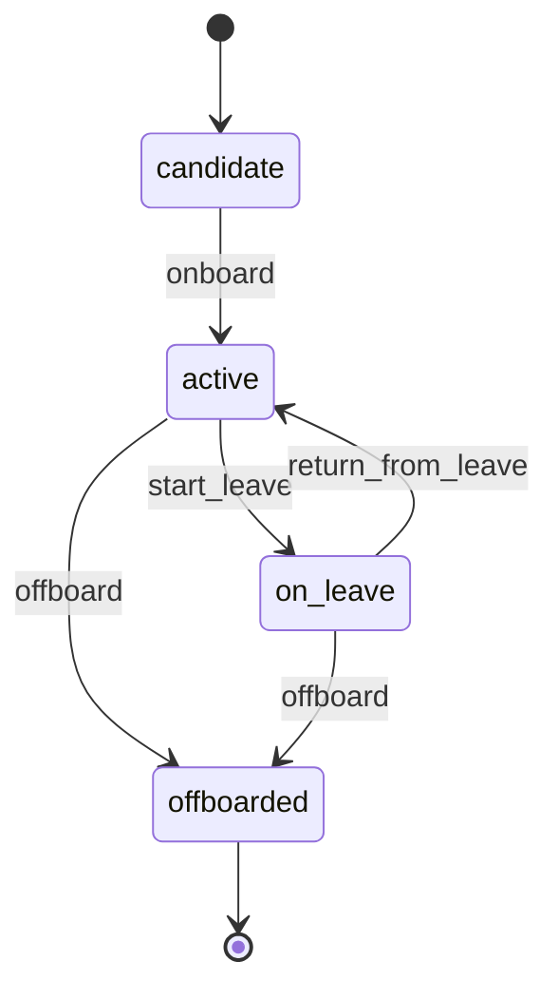

# Player Lifecycle

> A Player starts as a `candidate`, becomes `active` on their first day, can go `on_leave` (reversibly), and eventually becomes `offboarded` when they leave the organization.

## State diagram

## States

| State | Description | Entry conditions | Exit conditions |
|---|---|---|---|
| `candidate` | Offer accepted but not yet started. | Offer signed. | First day (`onboard`). |
| `active` | Working in the organization. | `onboard` or `return_from_leave`. | Leave begins or person departs. |
| `on_leave` | Temporarily away (parental leave, sabbatical, medical). Reversible. | `start_leave`. | Returns or decides not to return. |
| `offboarded` | No longer in the organization. | `offboard`. | Terminal. Record preserved for historical references. |

## Transitions

| From | To | Trigger | Actor | Validation | Side effects |
|---|---|---|---|---|---|
| — | `candidate` | `create` | HR / Org Steward | Offer letter signed. | Record created. `created_at` set. |
| `candidate` | `active` | `onboard` | HR / Org Steward | Start date reached; employment paperwork complete. | `joined_on` set. Player becomes eligible for Squad membership and Task assignment. |
| `active` | `on_leave` | `start_leave` | HR + Squad Lead | Leave approved. | Player hidden from active Task assignment. |
| `on_leave` | `active` | `return_from_leave` | HR + Squad Lead | Leave window closed. | Player returns to Squad assignment. |
| `active` | `offboarded` | `offboard` | HR + Org Steward | All owned Factories/Projects reassigned. Active Tasks reassigned or closed. | `offboarded_on` set. Squad memberships dropped. Roles stripped. |
| `on_leave` | `offboarded` | `offboard` | HR + Org Steward | Same as above. | Same as above. |

## State-dependent behavior

- When `candidate`: appears in hiring-pipeline views but not in operational dashboards. Cannot be assigned a Task.
- When `active`: default. Appears everywhere. Eligible for Squad membership, Task assignment, and Roles.
- When `on_leave`: appears with a "⏸" marker in dashboards. Excluded from Task auto-assignment. Squad memberships preserved; Roles preserved.
- When `offboarded`: hidden from operational dashboards. Historical links (past Tasks, authored Documents, past Squad membership) preserved. Record is **never** deleted.

## Examples

### Example 1 — Standard join and leave

Ana signs her offer at *Helios* on 2026-01-20. Her Player record is created with `state = candidate`. On 2026-02-01 (her first day), HR fires `onboard`, her `state` becomes `active`, she is added to the *Platform* Squad. Three years later she moves to another company: HR fires `offboard`, her Tasks are reassigned, her Squad memberships are dropped, `offboarded_on` is set. Her record stays — the historical Tasks she completed, Documents she authored, and Squads she led still reference her.

### Example 2 — Parental leave and return

A Squad Lead takes a 4-month parental leave. HR fires `start_leave`; the Player's state becomes `on_leave`. Her Squad Lead Role is preserved but the Squad appoints an acting Lead for the duration. Four months later, she returns; HR fires `return_from_leave`; `state` flips back to `active`. She resumes her Role. No data was lost, no history overwritten.
