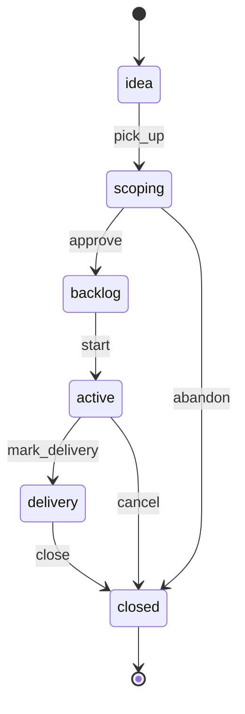

# Project Lifecycle

> A Project moves from `idea` through `scoping`, `backlog`, `active`, and `delivery`, and terminates in `closed` with a `close_reason`: `delivered`, `canceled`, or `absorbed`.

## State diagram

## States

| State | Description | Entry conditions | Exit conditions |
|---|---|---|---|
| `idea` | Raw proposal. Nothing scoped yet. | Created by any Player. | Picked up for scoping or silently dropped. |
| `scoping` | Deliverables, timeline, required Squads being defined. | `pick_up` fired. | Approval or abandonment. |
| `backlog` | Approved and waiting. A Squad is not yet available. | `approve` fired. | Scheduled to start. |
| `active` | Execution underway. | `start` fired. | Delivery phase or cancellation. |
| `delivery` | Deliverable produced; being reviewed, tested, and handed off. | `mark_delivery` fired. | Close. |
| `closed` | Terminal. `close_reason` records how the Project ended. | `close` or `cancel` or `abandon` fired. | Terminal. |

## Transitions

| From | To | Trigger | Actor | Validation | Side effects |
|---|---|---|---|---|---|
| — | `idea` | `create` | Any Player | `name` set. | Record created. |
| `idea` | `scoping` | `pick_up` | Project Owner assigned | Owner named. | Scoping work begins. |
| `scoping` | `backlog` | `approve` | Project Owner + Org Steward (or Brand Steward if brand-scoped) | Deliverables listed; Squads identified; timeline estimated. | Project enters the backlog. |
| `scoping` | `closed` | `abandon` | Project Owner | Reason recorded. | `close_reason = canceled`. `end_date` set. |
| `backlog` | `active` | `start` | Squad Lead + Project Owner | A Squad available. | `start_date` set. Kickoff ceremony scheduled. |
| `active` | `delivery` | `mark_delivery` | Project Owner | All planned deliverables complete or explicitly descoped. | Delivery tasks (testing, handoff, documentation) surface. |
| `active` / `delivery` | `closed` | `close` (delivered) | Project Owner | Deliverable accepted. No open Tasks. | `close_reason = delivered`. `end_date` set. Decision-log entry. |
| `active` / `delivery` | `closed` | `close` (absorbed) | Project Owner + Org Steward | Deliverable accepted. A new Factory has been created (`absorbed_into_factory_id` set). | `close_reason = absorbed`. `end_date` set. Decision-log entry. |
| `active` | `closed` | `cancel` | Project Owner + Org Steward | Rationale recorded. | `close_reason = canceled`. `end_date` set. Decision-log entry. |

## Close reasons

- `delivered` — the Project shipped; the outcome exists as designed; no ongoing operational need.
- `canceled` — the Project was abandoned before delivery; no outcome was produced.
- `absorbed` — the Project shipped *and* the outcome must now be operated continuously. `absorbed_into_factory_id` points to the newly-created Factory. **This is the most important transition in SquadFlow** — see [MANIFESTO.md](../../MANIFESTO.md).

## State-dependent behavior

- When `idea`: appears in the ideas pool. Not staffed.
- When `scoping`: Project Owner's queue. Not yet in execution dashboards.
- When `backlog`: visible in Portfolio Review. Not consuming Squad capacity.
- When `active`: default execution. Tasks on the Project's board are created. Weekly Squad Syncs include Project items.
- When `delivery`: appears with a "🏁 delivery" marker. New scope is rejected.
- When `closed`: hidden from active views. Retrospective held if `delivered` or `absorbed`; minimal postmortem if `canceled`.

## Examples

### Example 1 — A project that delivers and closes

*Billing Migration* at *Helios*: moved from custom billing to Stripe. States: `idea` (2 weeks) → `scoping` (3 weeks with the *Platform* Squad) → `backlog` (1 quarter waiting for capacity) → `active` (3 months of execution) → `delivery` (2 weeks of parallel-run testing) → `closed` with `close_reason = delivered`. No Factory is created — Stripe handles ongoing operations.

### Example 2 — A project absorbed into a factory (the canonical case)

*Launch Partner Program*: built the legal, operational, and commercial machinery for a partner ecosystem. States through `active` and `delivery` normally. At close, the Project Owner and Org Steward recognize the outcome (contracts, portal, onboarding, commissions) must run continuously. They create a *Partner Operations* Factory with the *Go-to-Market* Squad and name a Factory Manager. The Project closes with `close_reason = absorbed`; `absorbed_into_factory_id` points to the new Factory. A decision-log entry records the rationale.

### Example 3 — A project canceled midway

A *Mobile App MVP* Project starts, runs for six weeks, and hits a regulatory blocker that cannot be resolved in-period. The Project Owner and Org Steward discuss and `cancel`. Open Tasks are canceled. Completed deliverables are documented for future use. A brief postmortem is held; the decision-log entry explains why. The Project record stays; future Projects can reference the lessons.
