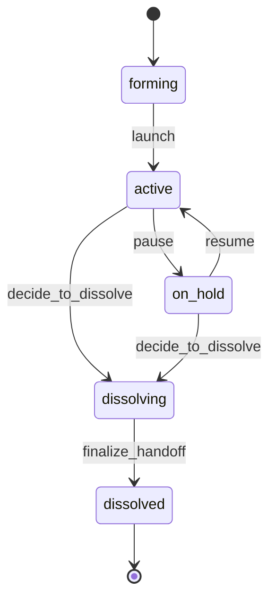

# Squad Lifecycle

> A Squad `form`s around a mandate, goes `active`, may go `on_hold` reversibly, enters `dissolving`, and terminates in `dissolved`.

## State diagram

## States

| State | Description | Entry conditions | Exit conditions |
|---|---|---|---|
| `forming` | Being staffed. Members being assembled. | Squad proposed by Org Steward. | At least two members (including Lead) assigned and mandate clear. |
| `active` | Running. Owns Factories, executes Projects. | `launch` fired. | Pause, or decision to dissolve. |
| `on_hold` | Paused. No new work intake; existing work handed to other Squads or paused. | `pause` fired. | Resume, or dissolve. |
| `dissolving` | Formal wind-down announced. Handoffs in progress. | `decide_to_dissolve` fired. | All Factories, Projects, and Tasks re-homed. |
| `dissolved` | Terminal. Team disbanded, members reassigned. | `finalize_handoff` fired. | Terminal. |

## Transitions

| From | To | Trigger | Actor | Validation | Side effects |
|---|---|---|---|---|---|
| — | `forming` | `create` | Org Steward | `name`, `company_id`, mandate (description) set. | Record created. |
| `forming` | `active` | `launch` | Squad Lead + Org Steward | ≥ 2 members (Lead + 1); at least one Factory or Project assigned. | `formed_on` set. Appears in dashboards. First Squad Sync scheduled. |
| `active` | `on_hold` | `pause` | Squad Lead + Org Steward | Reason recorded. Active work re-homed or paused. | Squad hidden from active planning. |
| `on_hold` | `active` | `resume` | Squad Lead + Org Steward | Capacity restored. | Squad returns to dashboards. |
| `active` / `on_hold` | `dissolving` | `decide_to_dissolve` | Org Steward + Squad Lead | Rationale logged. | Internal announcement. Handoff plan drafted. |
| `dissolving` | `dissolved` | `finalize_handoff` | Org Steward | All Factories reassigned to another Squad or retired; all active Projects re-homed or closed; all open Tasks reassigned or canceled. | `dissolved_on` set. Members' Squad membership removed. Record preserved. |

## State-dependent behavior

- When `forming`: Squad appears in a "forming" queue for staffing. Not yet running ceremonies.
- When `active`: default. Appears everywhere. Runs weekly Squad Sync. Owns kanban boards for assigned Factories.
- When `on_hold`: hidden from operational dashboards. Past deliveries and Documents remain linked.
- When `dissolving`: visible with a "🏁 dissolving" marker. Handoff checklist appears.
- When `dissolved`: hidden from all active views. Queryable in historical reports.

## Examples

### Example 1 — A squad formed, active, and eventually dissolved

At *Helios*, the *Onboarding* Squad is created to own customer-onboarding Factories and Projects. Its mandate: reduce time-to-value for new customers. `state = forming` while three engineers and one PM are assembled. On day one, the Lead fires `launch` with two members plus one Factory assigned (*Customer Onboarding*). Two years later, after onboarding became largely self-service, the Steward decides the dedicated Squad is no longer needed. `decide_to_dissolve` fires; the Factory is merged into the *Platform* Squad; remaining members are redistributed. `finalize_handoff` marks the Squad `dissolved`.

### Example 2 — A squad that pauses for a quarter

A content Squad enters a period of low demand — the quarter's Factories are handled by freelancers, and there is no active Project. The Lead and Steward agree to `pause` rather than dissolve, since the capability is expected to be needed again in six months. The Squad goes `on_hold`. Members are temporarily assigned to other Squads. Six months later, `resume` fires, members return, the Squad picks up where it left off.

### Example 3 — A squad that never leaves forming

A proposed *Security Squad* is created but never staffed — the hiring market is tight and the Org Steward decides to defer. The Squad stays in `forming` indefinitely, visible only in the forming queue. When priorities change a year later, the Steward either fires `launch` (if hires land) or quietly archives the record (if the mandate is dropped).
