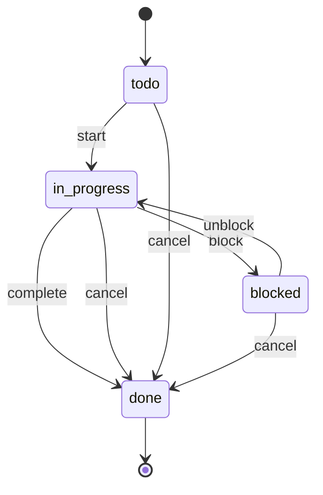

# Task Lifecycle

> A Task moves from `todo` to `in_progress` (possibly bouncing through `blocked`) and ends in `done`, either `completed` or `canceled`.

## State diagram

## States

| State | Description | Entry conditions | Exit conditions |
|---|---|---|---|
| `todo` | Not yet started. Assigned to a Player but untouched. | Created with an assignee. | Assignee starts or cancels. |
| `in_progress` | Assignee is actively working. | `start` fired. | Completion, cancellation, or blocker encountered. |
| `blocked` | Waiting on external input (another Task, another person, vendor response). | `block` fired with a reason. | Unblocked or canceled. |
| `done` | Terminal. Either `completed` or `canceled` as recorded in `done_reason`. | Completion or cancellation. | Terminal. |

## Transitions

| From | To | Trigger | Actor | Validation | Side effects |
|---|---|---|---|---|---|
| — | `todo` | `create` | Any Player | `assignee_id`, `parent_type`, `parent_id` set. | Record created. |
| `todo` | `in_progress` | `start` | Assignee | — | `updated_at` set. |
| `in_progress` | `blocked` | `block` | Assignee | Blocker reason recorded. | Assignee surfaces blocker at next Squad Sync. |
| `blocked` | `in_progress` | `unblock` | Assignee | Blocker resolved. | — |
| `in_progress` | `done` | `complete` | Assignee | Deliverable meets acceptance criteria. | `done_at` set. `done_reason = completed`. |
| `in_progress` / `blocked` / `todo` | `done` | `cancel` | Assignee or Parent Owner (Factory Manager, Project Owner, or Squad Lead) | Reason recorded. | `done_at` set. `done_reason = canceled`. |

## State-dependent behavior

- When `todo`: appears on the assignee's queue.
- When `in_progress`: appears with an active marker. Counted toward the assignee's in-flight WIP.
- When `blocked`: surfaces in the next Squad Sync agenda automatically. Counted against WIP but flagged.
- When `done`: disappears from active views. Shows up in retrospectives and in the parent's completed-work count.

## Examples

### Example 1 — A simple completed task

A Task *"Review the Stripe connector design doc"* is created with `assignee_id = Ana`, parent = *Billing Migration* Project. Ana `start`s the Task on Monday, finishes Wednesday, fires `complete`. `done_reason = completed`, `done_at = Wed 5 PM`.

### Example 2 — A blocked task that eventually unblocks

A Task *"Migrate production subscriptions"* is started, then `block`ed because production access has not been granted yet. The Task sits in `blocked` for three days. Once access is granted, `unblock` fires, the Task returns to `in_progress`, and is later completed. The time spent in `blocked` is visible in the Task history and surfaces in the Squad retrospective as a systemic issue.

### Example 3 — A canceled task

A Task *"Write the legacy-billing rollback playbook"* is created during the *Billing Migration* Project. Halfway through, the Project Owner decides the rollback is no longer needed (the new system has been stable for 30 days). The assignee fires `cancel`. `done_reason = canceled`. The Task is preserved — future analysis of the Project may want to see what was planned vs. what was cut.
